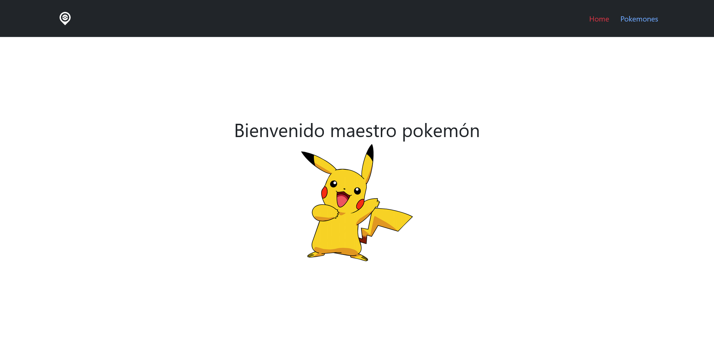
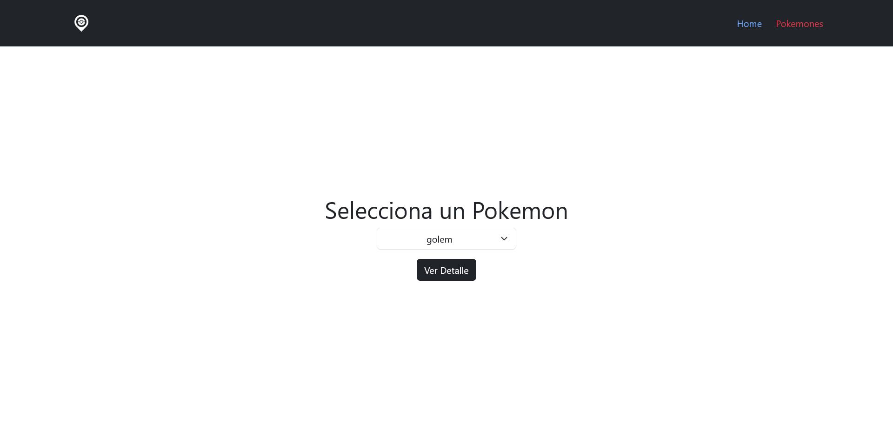
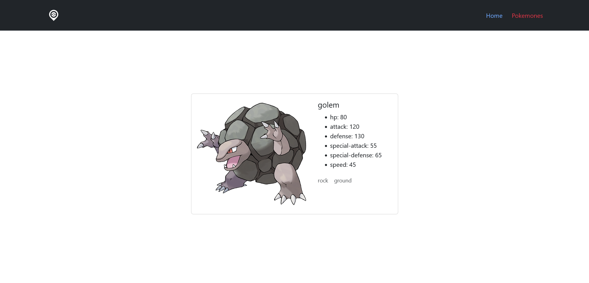

# Desafío - Router II

En este desafío, he desarrollado una aplicación llamada Router II, la cual utiliza React Router para la navegación entre diferentes vistas. Mi tarea principal fue implementar el redireccionamiento de rutas, obtener parámetros en una ruta y asignar una clase activa a la ruta que se está visitando en una SPA.

## Capturas de Pantalla 🖼️

### Home


### Pokemones


### Detalles del Pokemon


## Requerimientos del Desafío 🎯

1. **Asignar una clase active a la ruta que el usuario consulte usando NavLink.**
2. **Redireccionar programáticamente al usuario usando el hook useNavigate.**
3. **Obtener parámetros de la URL usando el hook useParams.**

## Código Relevante 🧩

### Contexto PokemonesContext

Este contexto se utiliza para manejar el estado global de los pokemones y la funcionalidad relacionada con la selección de un Pokemon.

```javascript
// Archivo: PokemonesContext.js

import { createContext, useEffect, useState } from "react"

export const PokemonesContext = createContext()

const PokemonesProvider = ({ children }) => {

  const [pokemones, setPokemones] = useState([])
  const [pokemonSelected, setPokemonSelected] = useState("")

  const getData = async () => {
    const url = "https://pokeapi.co/api/v2/pokemon/?limit=100000&offset=0"
    const response = await fetch(url)
    const data = await response.json()

    const dataArray = data.results.reduce((accumulator, currentValue) => {
      return accumulator.concat(currentValue.name)
    }, [])

    setPokemones(dataArray)
  }

  useEffect(() => {
    getData()
  }, [])

  const pokemonSelectedFunction = (e) => {
    setPokemonSelected(e)
  }

  const globalState = { pokemones, pokemonSelected, pokemonSelectedFunction }

  return (
    <PokemonesContext.Provider value={globalState}>
      {children}
    </PokemonesContext.Provider>
  )
}

export default PokemonesProvider
```

### Componente Finder

Este componente se encarga de mostrar un selector de Pokemon y redirigir al usuario a los detalles del Pokemon seleccionado.

```javascript
// Archivo: Finder.js

import { useContext } from "react"
import { PokemonesContext } from "../context/PokemonesContext"
import { useNavigate } from "react-router-dom"

const Finder = () => {

  const { pokemones, pokemonSelected, pokemonSelectedFunction } = useContext(PokemonesContext)
  const navigate = useNavigate()

  const goToPokemonSelected = () => {
    navigate(`/pokemones/${pokemonSelected}`)
  }

  return (
    <section className="finder-container">
      <div className="d-flex flex-column align-items-center gap-3">
        <select className="text-center form-select" value={pokemonSelected} onChange={(e) => pokemonSelectedFunction(e.target.value)}>
          <option value="">Pokemones</option>
          {pokemones && pokemones.map((pokemon, index) => (
            <option key={Date.now() + index} value={pokemon}>{pokemon}</option>
          ))}
        </select>
        <button type="button" className="btn btn-dark" onClick={goToPokemonSelected} disabled={pokemonSelected === ""}>Ver Detalle</button>
      </div>
    </section>
  )
}

export default Finder
```

### Componente NavMenu

Este componente es el menú de navegación que utiliza NavLink para asignar una clase activa a la ruta que el usuario está visitando.

```javascript
// Archivo: NavMenu.js

import { NavLink } from "react-router-dom"
import logo from "../../src/assets/img/logo.webp"

const NavMenu = () => {
  return (
    <nav className="navbar-container navbar navbar-expand-lg bg-dark border-bottom border-body" data-bs-theme="dark">
      <div className="container">
        <NavLink className="navbar-brand" to="/"></NavLink>
        <button className="navbar-toggler" type="button" data-bs-toggle="collapse" data-bs-target="#navbarNav" aria-controls="navbarNav" aria-expanded="false" aria-label="Toggle navigation">
          <span className="navbar-toggler-icon"></span>
        </button>
        <div className="collapse navbar-collapse" id="navbarNav">
          <ul className="ms-auto navbar-nav d-flex gap-4">
            <li className="nav-item">
              <NavLink className={({ isActive }) => (isActive ? "text-danger" : undefined)} to="/">Home</NavLink>
            </li>
            <li className="nav-item">
              <NavLink className={({ isActive }) => (isActive ? "text-danger" : undefined)} to="/pokemones">Pokemones</NavLink>
            </li>
          </ul>
        </div>
      </div>
    </nav>
  )
}

export default NavMenu
```

## Tecnologías Utilizadas 💻

- React
- React Router

## Estructura del Código 🧱

La aplicación está estructurada utilizando React, con componentes individuales para la página de inicio, la vista de Pokemones, la vista de detalles del Pokemon, y el manejo del estado global con Context API. Se ha utilizado React Router para la navegación entre las diferentes vistas de la aplicación.

## Mejoras Futuras 🚀

Para futuras iteraciones de la aplicación, se podría considerar agregar funcionalidades adicionales como la implementación de una búsqueda de Pokemon, la posibilidad de guardar Pokemones favoritos y la mejora del diseño de la interfaz de usuario.